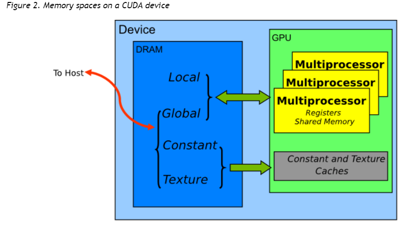

# 1 基本概念
## 1.1 硬件常识
SM(Stream Multiprocessor)

SP(Stream Processor): also known as CUDA Cores

要运行CUDA程序，需要安装：1）NVIDIA显卡驱动 （安装好显卡驱动后使用nvidia-smi就可以看到设备信息，上面会显示CUDA的驱动版本号）；2）CUDA Toolkit(用来编译CUDA程序的nvcc就包含在CUDA Toolkt里，CUDA的运行时版本就是CUDA Toolkit的版本号)
> nvcc hello-world.cu -o hello-world.out

nvcc是个编译驱动器，就像gcc以及LLVM中的clang。
## 1.2 CUDA的内存模型
* Global Memory: 所有threads可以访问
* Shared Memory: 为block内的threads共享
* Local Memory: 属于单个therad
* Constant Memory: 只读内存
* Texture Memory: 只读内存
在RTX 3060上，Global Memory为6GB，Constant Memory为64KB，每个Block的Shared Memory为48KB.

shared memory和registers都在片上，所以速度是最快的。各内存的读取速度从高到底排列为：register file > shared memory > constant memory > texture memory > local memory > global memory.

***
CUDA的内存可以分成`linear memory`和`CUDA arrays`
* linear memory: 使用`cudaMalloc()`分配，使用`cudaFree()`释放，使用`cudaMemcpy()`拷贝。
* CUDA arrays：不透明的内存布局，针对纹理内存的读取进行了优化。

## 1.3 线程层次
一个warp包含32个threads。warp是一个很重要的概念，线程的调度、执行以及存储器操作都是以warp为基本单位的。

# Shared Memory
共享内存的一个重点关注方向是**bank conflict**，如果可以避免**bank conflict**, 共享内存的速度可以和register相当。[《Bank Conflicts in Shared Memory in CUDA》](http://cuda-programming.blogspot.com/2013/02/bank-conflicts-in-shared-memory-in-cuda.html)这篇文章很好地解释了bank conflict。

在compute capacity较高的GPU上，一般将shared memory划分成均等的`32`个bank。1-32 bits(4个字节(1个int或1个float))在Bank0, 33-64 bits在Bank1，...，993-1024 bits在Bank31。1025-1056 bits在Bank0，以此类推。

# 其它参考资料
* [《OneFlow是如何做到世界最快深度学习框架的》](https://zhuanlan.zhihu.com/p/271740706)
